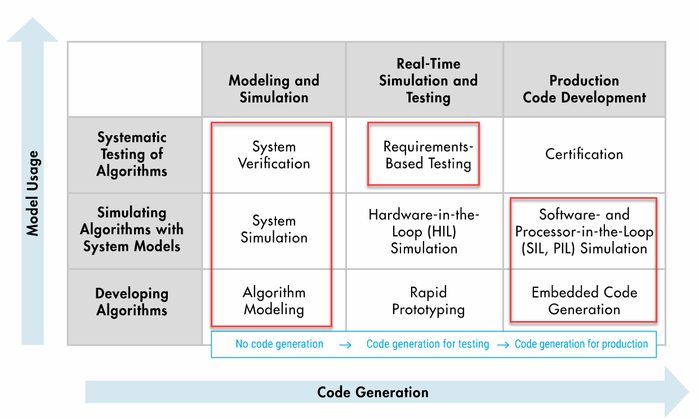

# Hemodialysis Machine Design with Simulink
\
In Silico Medicine refers to the use of computational models and simulations to mimic human anatomy and physiological processes in order to design, test and validate medical devices. With MATLAB&reg; and Simulink&reg;, you can leverage in silico medicine in the research and development of new medical devices, such as dialysis machines. This model demonstrates how to model and simulate an ultrafiltration control system for a hemodialysis machine with Simulink&reg; and Stateflow&reg;.

## Description 
Ultrafiltration in dialysis establishes a pressure gradient across the dialyzer to promote the diffusion of waste and fluid out of the bloodstream. Controling the ultrafiltration flow rate is essential to maintaining safe levels of hemodialysis for the patient. In this model of an ultrafiltration control system, the patient's relative blood volume, a key parameter in monitoring patients' status during hemodialysis, directly controls the ultrafiltration rate to ensure their blood volume does not drop below a critical threshold. This serves to prevent interdialytic hypotension caused by rapid loss of blood volume during hemodialysis.

## Setup
* Download the zipped file, uncompress, and add the directory to MATLAB path.
* Open 'DialysisDemo.prj' to get started.
* In the toolstrip, use the project shortcut button 'dialysisDemo' to open the example.
* Requires MATLAB&reg; release R2023a or newer.
## What's Included

This project covers many short examples of critical model based design workflow. As, you can see from figure below, except realtime simulation/testing and cerrtification, we have provided all other examples. Please follow scripts below to execute each segment of the workflow.

**[i] Requirement Management:** Click on 'Requirements' folder from project. You will find system level original requirement document (Hemodialysis_Requirements.xlsx) and imported requirements set (Hemodialysis_Requirements.slreqx) into requirement toolbox. Requirement set can also be access from project shortcut (SYSTEMSENGINEERING group).
**[ii] Architecture Diagram:** Functional, logical and sequence diagrams are in /Models/1. Architecture folders. Logical architecture diagram can also be access from project shortcut (SYSTEMSENGINEERING group)

**[iii] Algorithm Design:** Open a high level dialysis demo which contains plant (dual chamber UF system + dialyzer) and controller models from project shortcut (MAIN_MODEL group). Dual chamber ultrafiltration system's physical model created using Simscape is found in /Models/2. Physical Systems or alternatively can be accessed from project shortcut (PLANT_MODEL) group.
    
**[iv] Simulink Test:** Example of unit tests from test sequence block and signal editor input blocks can be access from project shortcut (TEST group).
    
**[v] Simulink Coverage:** Simulink design verifier creates test after checking missing coverage from existing tests. "Missing_Coverage_Test" is a disabled testcase in Dialysis-Machine-Simulink.mldatx file which one can access from project shortcut (TEST group). 
    
**[vi] Code Generation:** C/C++ code can be generated from UFR_Controller.slx model stored in /Models/4. Code Generation folder .
    
**[vii] SIL/PIL Testing:** HemoDialysis_SILTest.mldatx test numerically check equivalency between controller model and generated code.

 Model Based Design Workflow examples: 

Copyright 2023 The MathWorks, Inc.
