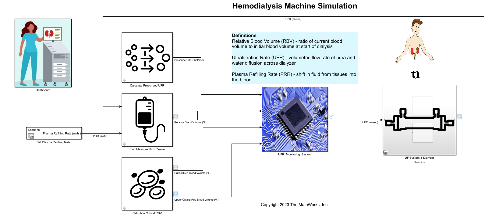

# Hemodialysis Machine Design with Simulink

In Silico Medicine refers to the use of computational models and simulations to mimic human anatomy and physiological processes in order to design, test and validate medical devices. With MATLAB&reg; and Simulink&reg;, you can leverage in silico medicine in the research and development of new medical devices, such as dialysis machines. This model demonstrates how to model and simulate an ultrafiltration control system for a hemodialysis machine with Simulink&reg; and Stateflow&reg;.

## Description 
Ultrafiltration in dialysis establishes a pressure gradient across the dialyzer to promote the diffusion of waste and fluid out of the bloodstream. Controling the ultrafiltration flow rate is essential to maintaining safe levels of hemodialysis for the patient. In this model of an ultrafiltration control system, the patient's relative blood volume, a key parameter in monitoring patients' status during hemodialysis, directly controls the ultrafiltration rate to ensure their blood volume does not drop below a critical threshold. This serves to prevent interdialytic hpotension caused by rapid loss of blood volume during hemodialysis.

## Setup
* Download the zipped file, uncompress, and add the directory to MATLAB path.
* Open 'DialysisDemo.prj' to get started.
* In the toolstrip, use the project shortcut button 'dialysisDemo' to open the example.
* Requires MATLAB&reg; release R2023a or newer.

Copyright 2023 The MathWorks, Inc.
